# lottery-system

## Description
This is a Lottery System application which exposes APIs or web-services that allows users to participant in a lottery. Lottery participants will be able to submit as many lottery ballots for any lottery that is active.

Moreover, at midnight every day the lottery event will be considered finished and random lottery winner will be selected from all the registered participants of that lottery for that day. The participants will be able to check the winning ballot for any specific date.


## Requirements
- Java v1.8
- SpringBoot
- Postgres DB
- Gradle v7.5
- Unix environment


## How to Build / Test / Run
- Build and Run UnitTests
    ```
    cd PROJECT_DIRECTORY
    ./gradlew clean build
    ```
- Run/Deploy
    ```
    cd PROJECT_DIRECTORY
    java -jar build/libs/lotterysystem-0.0.1-SNAPSHOT.jar
    ```


## Implementation Key Points
- **KISS Principle:** I have tried my best to keep the code very simple, modular and testable to enable people to play around with the APIs or webservices using Postman tool.
- **Java Documentation:** One of the most essential part when implementing webservices or APIs which are user interactive is Documentation. I have added JavaDoc for all interfaces, classes and methods which will improve the readability of the code.
- **Integration Tests:** I have provided integrated unit tests for API endpoints to mimic the web environment using MockMvc. This will allow everyone of understand various scenarios during application execution


## Points omitted from the assignment
- I have tried to cover all the instructions and requirements mentioned in the assignment PDF. If there is anything missed, I would be happy to discuss.


## Database Design
I have created 3 tables for the lottery system design.

1. user_details - Holds participant details
2. lottery_details - Holds lottery information
3. lottery_ballot - Holds ballot information for lotteries

Below is the structure of tables,

**user_details**
- id
- username
- firstname
- lastname

**lottery_details**
- id
- lottery_name
- start_date
- end_date
- lottery_winner

**lottery_ballot**
- id
- lottery_id
- username
- lottery_number
- date

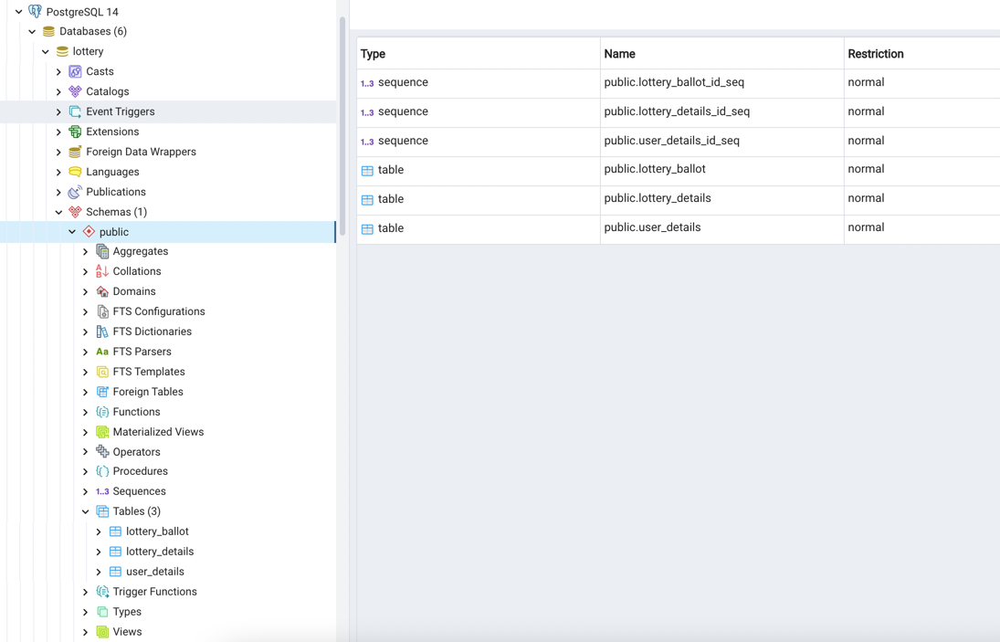


## API Responses using Postman
- Successful participant registration
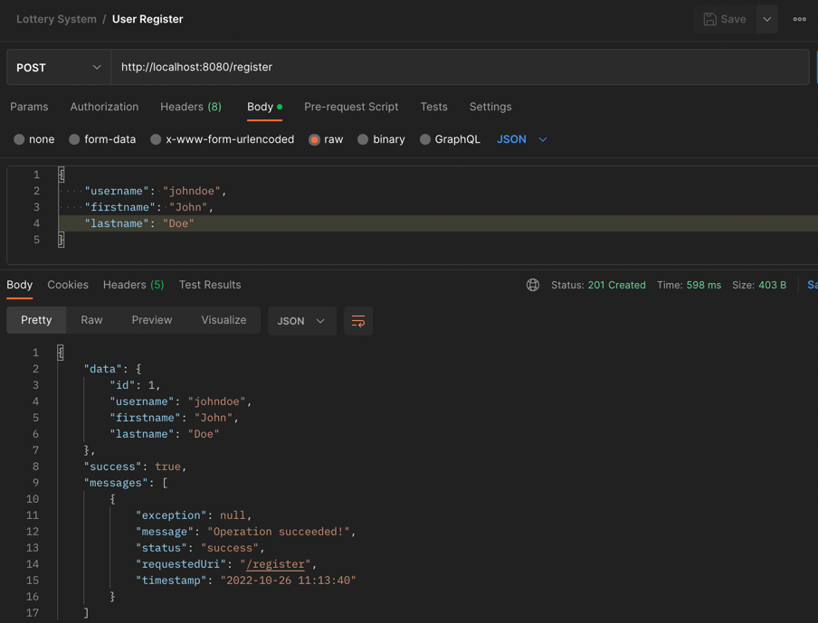

- Username already exists exception
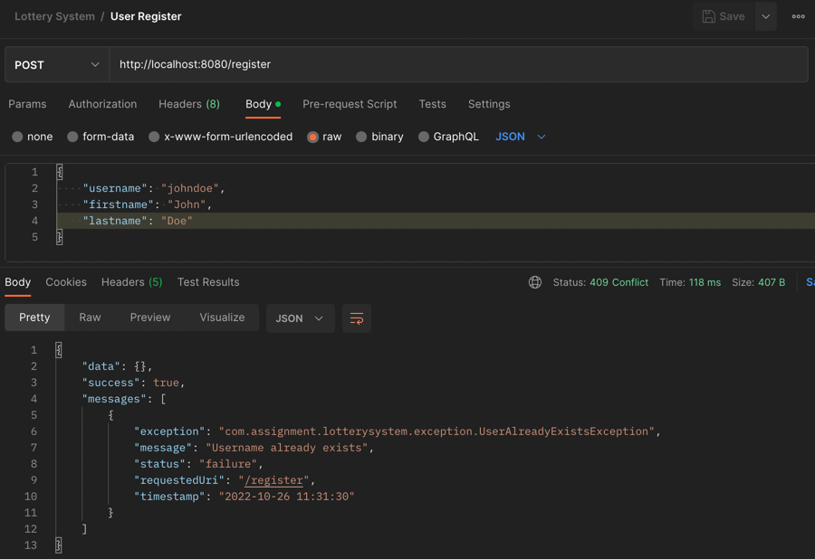

- Username constraint violation
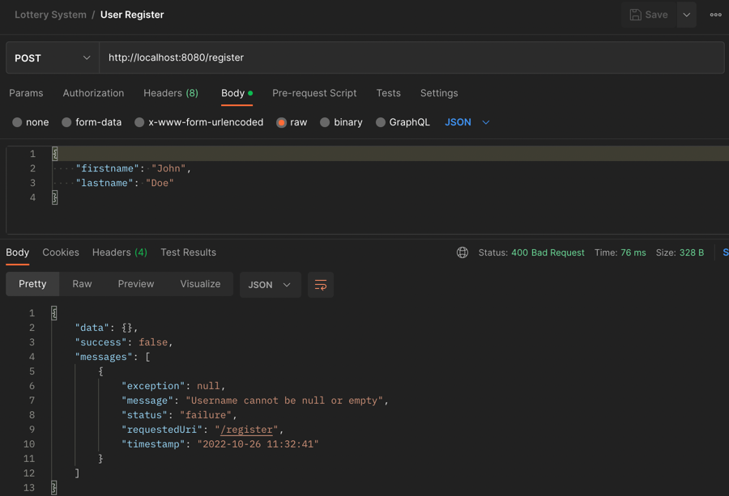

- Start lottery by name
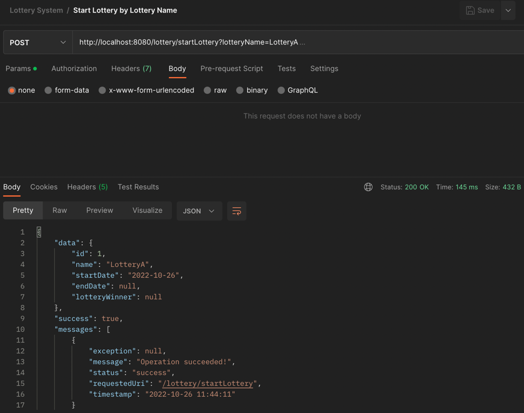

- Lottery name already exists exception
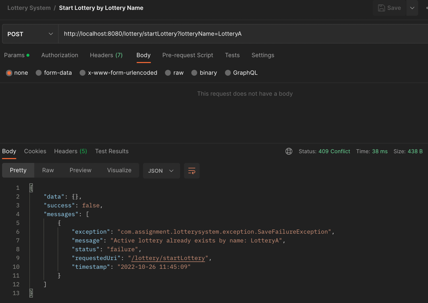

- Submit lottery by id and username
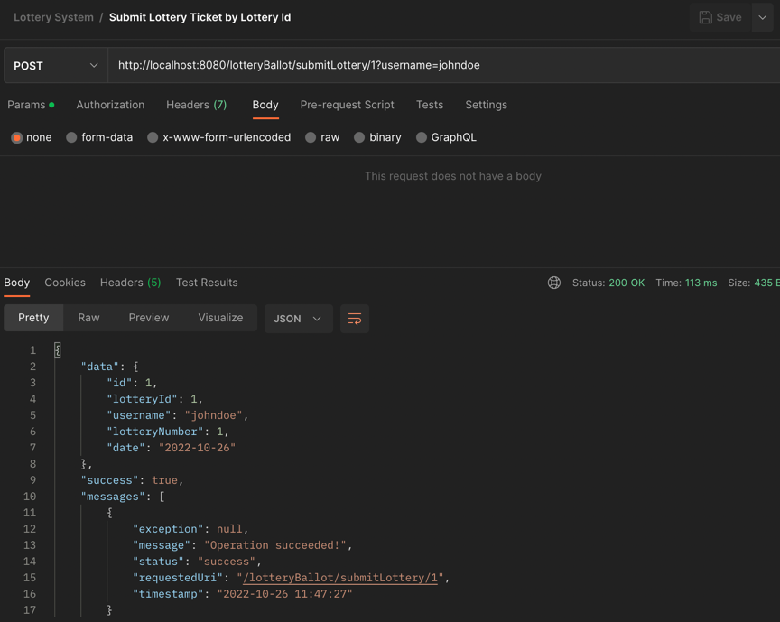

- Username not found exception
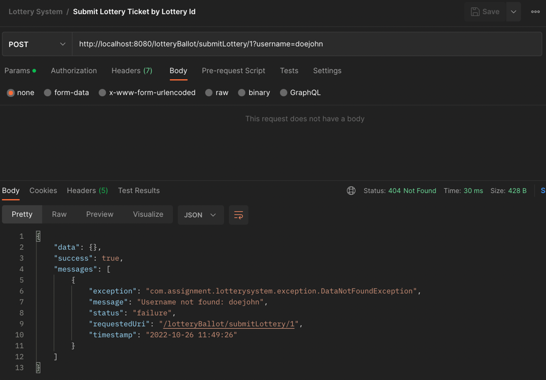

- Lottery not found exception
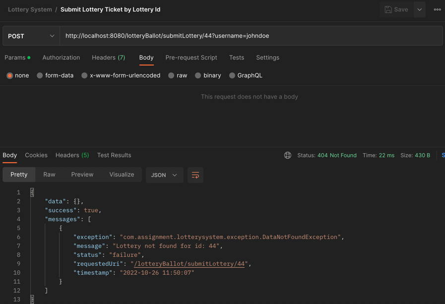

- Fetch all active lotteries
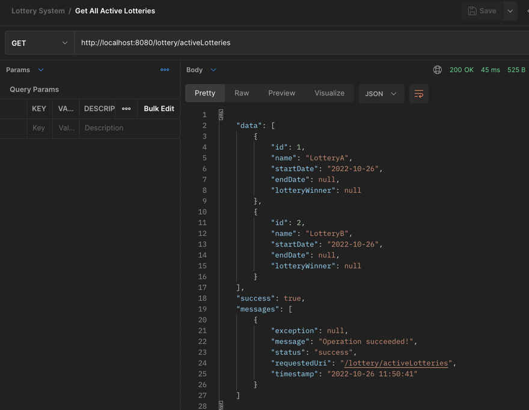

- End lottery by id
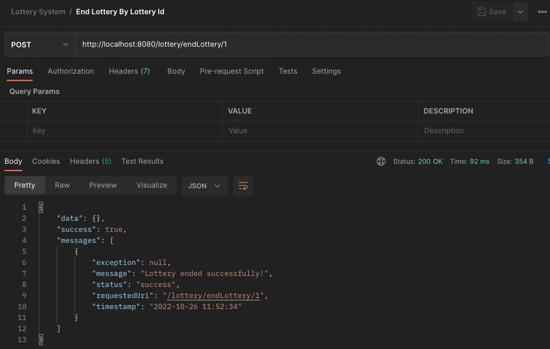

- Lottery not found to End
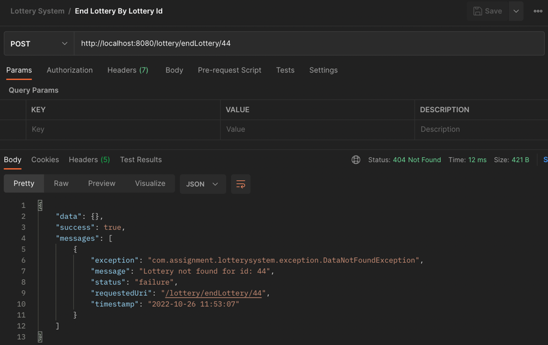

- Fetch lottery result by id and date
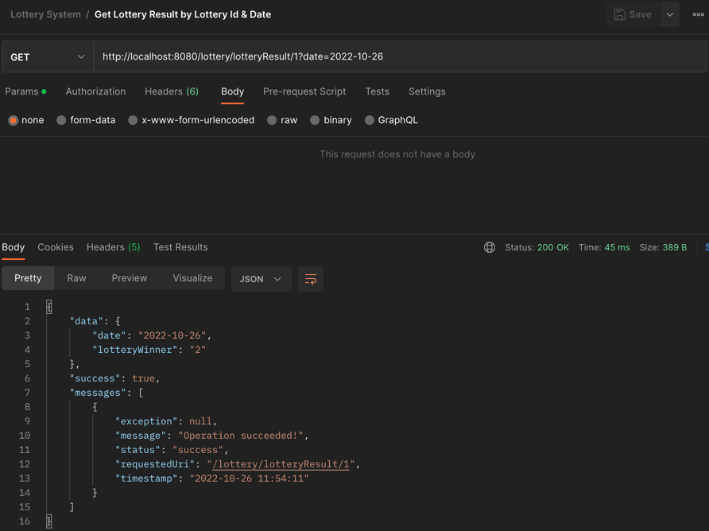

- Winning ballot not found for specified date
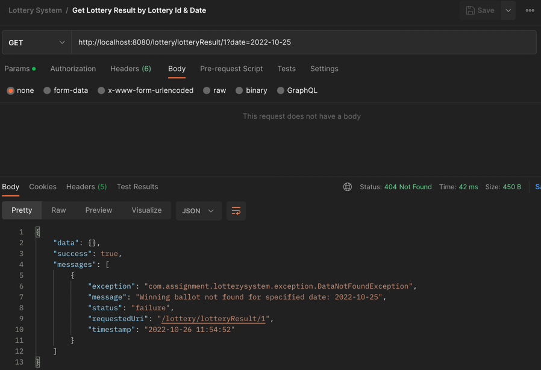

- End all active lotteries
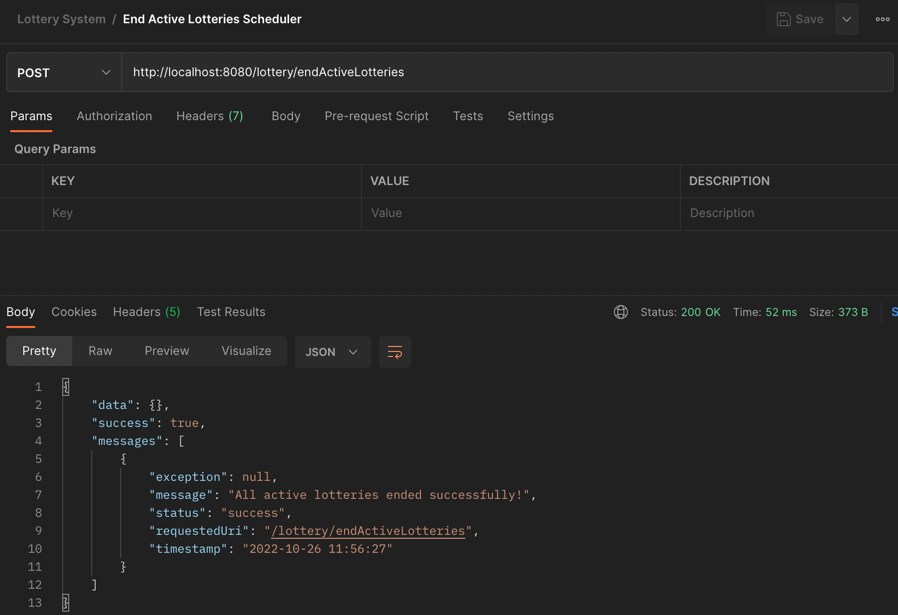